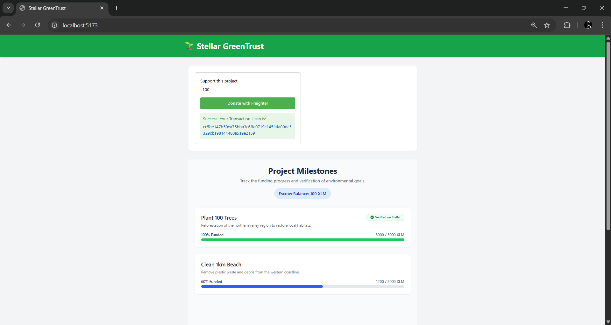

# 🌱 Stellar GreenTrust

**A decentralized, milestone-based donation platform for environmental projects.**


---

## 📖 Project Overview

**Stellar GreenTrust** is a decentralized donation platform built on the Stellar network using Soroban smart contracts. It connects eco-conscious donors with environmental NGOs to fund green initiatives with complete transparency.

Unlike traditional platforms, GreenTrust utilizes a milestone-based escrow system. Donated funds are securely locked in a smart contract and are only released to project owners when specific, verifiable environmental goals are achieved—such as planting a set number of seedlings or securing designated land areas. 

This performance-based funding model ensures that every donation results in measurable impact. It eliminates fraud, builds trust, and empowers donors to confidently support sustainable projects, knowing their contributions are directly driving real-world environmental change.

---

## 🔭 Vision

> *"Our vision is to fundamentally resolve the crisis of trust in the donation ecosystem by leveraging the lightning-fast infrastructure and absolute transparency of the Stellar network. By eliminating the 'where is my money going?' doubt created by traditional systems, we are building a future where every single donation translates into direct, measurable, and verifiable environmental impact.*
>
> *At Stellar GreenTrust, we are establishing an unbreakable technological bridge between eco-conscious donors and the projects healing our world. We are regreening the future of our planet with the security of smart contracts and the absolute transparency of blockchain technology."*

---

## 🛠️ Development Plan

Our development lifecycle is structured into 5 concrete phases:

### 1. Soroban Data Structures & State Design
* **Variables:** `Project` (ID, owner, goal, status), `Milestone` (ID, allocation, verification), `DonationRecord`.
* **Features:** Secure escrow initialization and role-based access control (RBAC) for donors, NGOs, and verifiers.

### 2. Core Smart Contract Functions (Rust)
* `create_project()`: Initializes a new project and escrow state.
* `add_milestones()`: Breaks down the funding goal into actionable steps.
* `donate()`: Accepts Stellar assets securely into the escrow.
* `verify_milestone()`: Restricted Oracle/admin function to cryptographically sign off on real-world goals.
* `release_funds()`: Automatically triggers payouts to the NGO upon verification.

### 3. Backend Integration & Event Indexing
* **Off-Chain Data:** Node.js server paired with IPFS for heavy metadata (images, reports).
* **Event Listening:** Indexing Soroban contract events (e.g., `DonationReceived`) for lightning-fast frontend queries.

### 4. Frontend Development & Wallet Connectivity
* **UI/UX:** Responsive Next.js/React web app featuring project discovery and NGO admin dashboards.
* **Wallet:** Native integration with **Freighter Wallet** for seamless transaction signing in the browser.

### 5. Testing & Deployment on Stellar Testnet
* Rigorous Rust-based unit testing for escrow security.
* `.wasm` compilation and deployment via Stellar CLI.
* Full system integration testing on the Stellar Testnet.

---

## ⚙️ Installation

Follow these steps to run the application locally:

**1. Clone the repository:**
```bash
git clone https://github.com/your-username/stellar-greentrust.git
cd stellar-greentrust
```

**2. Start the Backend:**
```bash
cd backend
npm install
npm start
```

**3. Start the Frontend (in a new terminal):**
```bash
cd frontend
npm install
npm run dev
```

---

## 🌐 Smart Contract Deployment

**Network:** Stellar Testnet
**Contract ID:** `CCQCXA3GYJRUBKFOD6HQZQOEJUF7HNHFQDXXCBPOR6NU3EGOBEZRWYBA`
**Donation Transaction Hash:** 
`cc5be147b50ea75bba3c6ffe0719c145fafa00dc5329cba98144480a5a9e2159`

---

## 📸 Project Screenshots



---

## 👨‍💻 About Me

Hi, I'm **Efe**, a Computer Programming student and software developer deeply passionate about the intersection of blockchain technology and social impact. 

Driven by a desire to solve real-world trust issues, I joined the **Build On Stellar Bootcamp**. My focus is on leveraging Soroban smart contracts to develop transparent, decentralized financial solutions. My ultimate goal is to create a secure ecosystem where every single donation is trackable, and its real-world impact is cryptographically verified—empowering people to give with total confidence.
